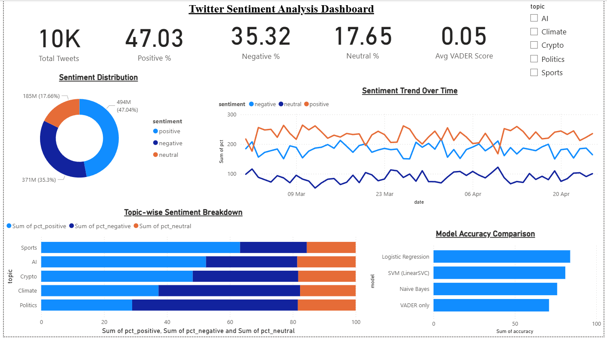
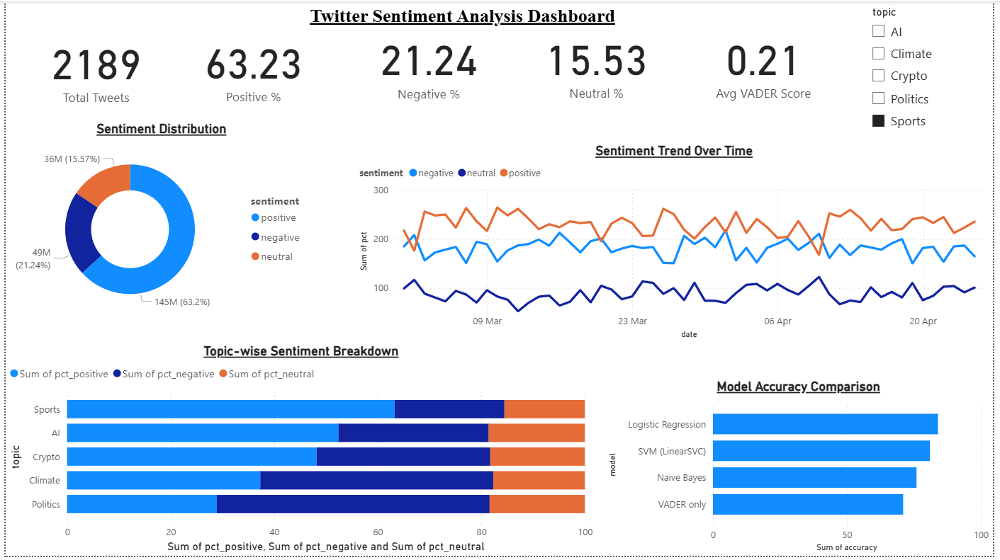

# 🐦 twitter-sentiment-powerbi

> Twitter sentiment analysis pipeline using Python, NLTK & VADER with a Power BI dashboard for real-time trend visualization.


---

## 📌 Overview

This project builds an end-to-end **Twitter/X Sentiment Analysis Pipeline** that:
- Collects tweets using the Twitter API
- Preprocesses and cleans text data
- Analyzes sentiment using **NLTK** and **VADER**
- Exports structured results to Excel (`.xlsx`)
- Visualizes trends in a **Power BI** interactive dashboard

---

## 📁 Project Structure

```
twitter-sentiment-powerbi/
│
├── dashboard/
│   ├── Screenshots/
│   │   ├── image1.png
│   │   └── image2.png
│   ├── Twitter_Sentiment_Dashboard.pbix
│   └── twitter_sentiment_powerbi.xlsx
│
├── 1_data_collection.py
├── 2_preprocessing.py
├── 3_modeling.py
├── 4_powerbi_export.py
├── 5_scheduler.py
├── config.py
├── .gitignore
└── README.md
```

---

## 📊 Dashboard Preview

### Sentiment Overview


### Trend Visualization


---

## ⚙️ Pipeline Steps

### 1. `1_data_collection.py`
Connects to the Twitter/X API using `Tweepy` and collects tweets based on configurable keywords, hashtags, or user handles. Stores raw tweet data locally.

### 2. `2_preprocessing.py`
Cleans and normalizes raw tweet text:
- Removes URLs, mentions, hashtags, emojis
- Tokenizes and lowercases text
- Removes stopwords using NLTK

### 3. `3_modeling.py`
Applies **VADER (Valence Aware Dictionary and sEntiment Reasoner)** from NLTK to score each tweet:
- `Positive` — compound score ≥ 0.05
- `Neutral` — compound score between -0.05 and 0.05
- `Negative` — compound score ≤ -0.05

### 4. `4_powerbi_export.py`
Exports the analyzed dataset to a structured `.xlsx` file compatible with Power BI's auto-refresh data source.

### 5. `5_scheduler.py`
Automates the pipeline to run at defined intervals (e.g., every hour) using Python's `schedule` library for near real-time updates.

---

## 🚀 Getting Started

### Prerequisites

- Python 3.8+
- Twitter Developer Account with API credentials
- Microsoft Power BI Desktop

### Installation

```bash
# Clone the repository
git clone https://github.com/Yadavsuryansh/twitter-sentiment-powerbi.git
cd twitter-sentiment-powerbi

# Install dependencies
pip install -r requirements.txt

# Download NLTK data
python -c "import nltk; nltk.download('vader_lexicon'); nltk.download('stopwords')"
```

### Configuration

Edit `config.py` with your Twitter API credentials:

```python
API_KEY = "your_api_key"
API_SECRET = "your_api_secret"
ACCESS_TOKEN = "your_access_token"
ACCESS_TOKEN_SECRET = "your_access_token_secret"

SEARCH_KEYWORDS = ["#Python", "#AI", "#MachineLearning"]
TWEET_COUNT = 500
```

### Running the Pipeline

```bash
# Run each step manually
python 1_data_collection.py
python 2_preprocessing.py
python 3_modeling.py
python 4_powerbi_export.py

# OR run the automated scheduler
python 5_scheduler.py
```

---

## 📈 Power BI Dashboard

1. Open `dashboard/Twitter_Sentiment_Dashboard.pbix` in Power BI Desktop
2. Update the data source to point to the generated `twitter_sentiment_powerbi.xlsx`
3. Click **Refresh** to load the latest sentiment data
4. Publish to Power BI Service for real-time sharing

**Dashboard Features:**
- Sentiment distribution (Positive / Neutral / Negative)
- Tweet volume over time
- Top trending keywords & hashtags
- Geographic sentiment heatmap (if location data is available)
- Influencer-level sentiment breakdown

---

## 🛠️ Tech Stack

| Component | Technology |
|-----------|------------|
| Language | Python 3.8+ |
| Data Collection | Tweepy |
| Text Processing | NLTK |
| Sentiment Analysis | VADER |
| Data Storage | Pandas, Excel (.xlsx) |
| Visualization | Microsoft Power BI |
| Scheduling | schedule |

---

## 🤝 Contributing

Pull requests are welcome! For major changes, please open an issue first to discuss what you'd like to change.

---

## 👤 Author

**Yadavsuryansh**
- GitHub: [@Yadavsuryansh](https://github.com/Yadavsuryansh)

---

*Built with Python, NLTK, VADER & Power BI*
